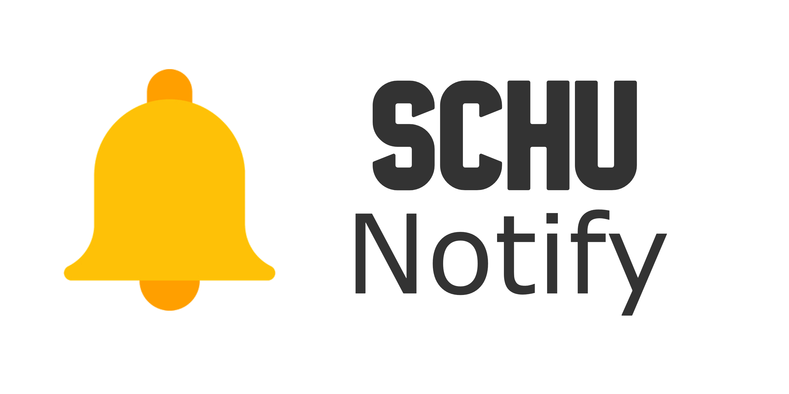
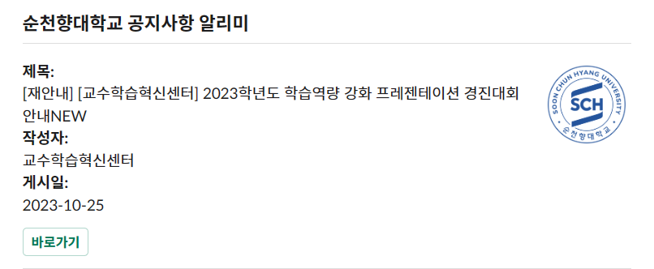

<p align="center"></p>

**순천향대학교 학사 공지사항 알리미 입니다.**

개발 기간 : 2023.10.26 ~ 2023.10.26 (1시간)

## 프로젝트 소개
기존 대학교 공지 사항을 확인하기 위해 주기적으로 접속해야 하는 단점이 존재했습니다. 이 단점을 보완하고자 공지 사항 및 학사 공지, 장학 공지, 취업 공지를 매일 8시간마다 크롤링하여 Slack 메시지로 전송함으로써 알림을 울리게 하여 공지 사항을 더욱 편하게 확인하고자 제작하였습니다. 또한 주기적으로 실행하기 위해 서버리스 아키텍쳐를 이용하여 구동하였습니다.

## 실사용 사진


## 개발환경
* 운영체제 : Windows 11 x64 (22H2, 22621.2428)
* 사용 언어 : Python 3.12.0
* 사용 라이브러리 : [BeautifulSoup4(4.12.2)](https://pypi.org/project/beautifulsoup4/), [slack_sdk(3.23.0)](https://pypi.org/project/slack-sdk/)
* 사용 서버리스 호스팅 : [Naver Cloud Functions](https://www.ncloud.com/product/compute/cloudFunctions)

## 설치하기

### 라이브러리 설치
```bash
pip install beautifulsoup4==4.12.2
pip install slack-sdk==3.23.0
```

### 프로젝트 설치
```bash
git clone https://github.com/mokminsu/SCHU-Notify.git
cd SCHU-Notify
```

## 실행하기

### 바로 실행하기
```py3
args = {
    'slack_token': 'token',
    'slack_channel_id_1': 'channel1',
    'slack_channel_id_2': 'channel2',
    'slack_channel_id_3': 'channel3',
    'slack_channel_id_4': 'channel4'
}

main(args)
```

### 서버리스 아키텍쳐에서 실행하기
* 네이버 클라우드 플랫폼의 클라우드 펑션을 이용한 가이드입니다.
* 자세한 설명은 네이버 클라우드 플랫폼에서 확인하실 수 있습니다. ([네이버 클라우드 펑션](https://www.ncloud.com/product/compute/cloudFunctions) | [네이버 클라우드 펑션 파이썬 가이드](https://guide.ncloud-docs.com/docs/cloudfunctions-example-python))
1. 트리거를 생성해야합니다. 트리거의 종류는 Cron이며, 소스를 실행 할 주기를 설정합니다.
2. 액션을 생성해야합니다. 타입은 일반 액션이며, 디폴트 파라미터는 다음과 같은 형식으로 작성하면 됩니다.
    * 채널 아이디가 4개인 이유는 4개의 게시판을 크롤링하기 때문입니다.

    ```js
    {
        "slack_token": "tokne",
        "slack_channel_id_1": "channel1",
        "slack_channel_id_2": "channel2",
        "slack_channel_id_3": "channel3",
        "slack_channel_id_4": "channel4"
    }
    ```
3. Module Not Found 오류를 막기 위해 소스폴더에 라이브러리를 추가한뒤 압축합니다.
    ```bash
    pip install slack-sdk==3.23.0 -t ./
    pip install beautifulsoup4==4.12.2 -t ./
    ```

    * 압축 후 디렉터리 형식은 다음과 같습니다.
    ```
    ├── 라이브러리 폴더 N개
    ├── __main__.py
    ```
4. 런타임을 **Python:3.11**로 수정후 소스 압축 파일을 업로드 합니다.

5. Main 함수의 이름은 main 이며, 액션 메모리와 액션 타임아웃은 유동적으로 설정합니다.
    
    * 이 프로젝트에서는 128MB와 15000ms(15초)로 설정하였습니다. (예상 요청수는 넉넉잡아 1개월당 50건)

* 2023.10.26 기준 위의 설정 값을 네이버에서 제공하는 요금 계산기에 대입해 보았을때, 1개월 예상 요금은 0원입니다. (매월 400,00GB-초 무료 제공 | [네이버 요금 계산기](https://www.ncloud.com/charge/calc/ko?category=compute#cloudFunctions))

## 함수 설명
* **fetch_current_notices** : 해당 페이지의 공지사항들의 제목, 작성자, 작성일을 스크랩
* **post_to_slack** : 슬랙으로 메시지를 전송함

## 사용 스택

### 개발 환경


             

### 개발 언어


## TODO
- [x] 다른 게시판 모두 크롤링 (2023.10.26 기능 추가 완료)


## 유의사항
이 프로젝트는 해당 웹사이트의 웹 크롤러 같은 로봇들의 접근을 제어하기 위한 규약을 준수하였습니다.

그러나 해당 프로젝트의 사용으로 인해 발생하는 모든 피해를 책임지지 않습니다.


## 라이센스
이 프로젝트는 [MIT License](LICENSE)로 배포됩니다.
